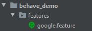
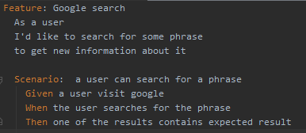

## Who am I?

Python developer  
Scrum Master  
Tech and soft skills trainer  
Creative Mom  
Visual Thinking enthusiast  

Where you can find me:  

## Workshop goals

After the training:
* You will know the BDD concept and its advantages
* You will know how to work with `behave` framework  
* You will be able to create tests based on gained knowledge  

## Agenda

- [BDD - let's grab a little context](#bdd)
  - [What is behavior?](#what-is-behavior)
  - [What is BDD?](#what-is-bdd)
  - [Benefits of BDD](#benefits-of-bdd)
  - [Python BDD test frameworks](#python-bdd-test-frameworks)
- [Behave test Framework](#behave-test-framework)  
  - [Installation check](#installation-check)  
  - [Feature files](#feature-files)  
    - [Gherkin mechanics](#gherkin-mechanics)  
    - [Writing a scenario](#writing-a-scenario)  

# BDD
## What is behavior?
In software it describes how the software operates  

I had a problem. While using and teaching agile practices like test-driven development (TDD) on projects in
different environments, I kept coming across the same confusion and misunderstandings. Programmers wanted
to know where to start, what to test and what not to test, how much to test in one go, what to call their
tests, and how to understand why a test fails.  
[_Dan North_](https://dannorth.net/introducing-bdd/)

Where does TDD fall short:
* In TDD process developers want to know what to test, how much to test, and how to understand failing tests
* Whiteout clear guidelines as to what should be tested and how confusion and misunderstanding are common
* Presenting in a different light through BDD allow the development process to avoid a number of pitfails

### It answers WHAT more than HOW
Behavior are defined early in development using specification by example: plain-language descriptions (Gherkin) that tell what more than how
Behavior specs becomes requirements, ACC and acceptance tests (all in one)  

BDD emphasizes the client's perspective  

## What is BDD?
BDD is a second-generation, outside–in, pull-based, multiple-stakeholder, multiple-scale, high-automation, 
agile methodology. It describes a cycle of interactions with well-defined outputs, resulting in the delivery 
of working, tested software that matters. 

_Dan North_ 

## Benefits of BDD

The Big BDD picture: The main goals of BDD are collaboration and automation

* Allows everybody involved to write tests not just coders
* Supports collaboration - behviors testing allows you to test your application as a whole in such a way that all
stakeholders can define and understand what is being test
* Supports automation
* Behavior are identified using specification by example
* Encourage thinking about the application in a natural consistent language
* Behavior specs becomes requirements, ACC and acceptance tests (all in one)
* BDD is a refinement of Agile process, not an overhoul - formalizes ACC and test coverage

## Python BDD test frameworks

[Behave](https://behave.readthedocs.io/en/latest/)  
[pythest-bdd](https://pytest-bdd.readthedocs.io/en/latest/)  
[radish](http://radish-bdd.io/)  
[lettuce](http://lettuce.it/)  
  
[Python BDD framework comparison - Automation Panda Blog](https://automationpanda.com/2019/04/02/python-bdd-framework-comparison/)

# Behave Test Framework
## Installation check

Pre-training preparation - [behave_workshop/installation.md](installation.md)

## Feature Files

Feature files has a natural language format - describing a feature or part of a feature with representative examples of
expected outcomes

### Gherkin mechanics
Given, when, then (and, but) - forms the actual steps. Those map to python step implementation.

**Feature**: feature name  

&nbsp;&nbsp;**Scenario**: some scenario   
&nbsp;&nbsp;&nbsp;&nbsp;**Given** some condition #put the system in a known state   
&nbsp;&nbsp;&nbsp;&nbsp;**When** some action taken #we take key action the user or external system performs   
&nbsp;&nbsp;&nbsp;&nbsp;**Then** some result is expected. #we observe outcomes   

You may also include "And" or "But" as a step - those are renamed by behave to take the name of their preceding step
### Writing a scenario

Behave operates on paths
1. features - with feature files written by your business analyst / sponsor / product owner / whoever 
with your behavior scenarios
2. steps - with python step implementation for the scenarios

Steps:  
1. Create a `features` directory in your project path  
2. In `features` directory create a file `google.feature`  

3. Write your first scenario  
  

### A scenario outline
### TO DO (Example)

## Python comes into play

Step definitions (Gluing step to definitions (decorators))

+--features/  
|   +--steps/       # -- Steps directory  
|   |    +-- *.py   # -- Step implementation or use step-library python files.  
|   +-- *.feature   # -- Feature files written by your Business Analyst / Sponsor / whoever   
                    # with your behaviour scenarios in it  
                    
### Scenario Context

### Hooks 
environement.py
+-- features/  
|     +-- steps/  
|     |    +-- website_steps.py  
|     |    +-- utils.py  
|     |   
|     +-- environment.py      # -- Environment controls(code to run before and after steps, scenarios, features or the whole shooting match)  
|     +-- signup.feature  
|     +-- login.feature  
|     +-- account_details.feature  

# Summary on how Behave works

#Practice
Blog features - [blog/features](../blog/features)  
E-learning portal features - [e-learning_portal/features](../e-learning_portal/features)  

