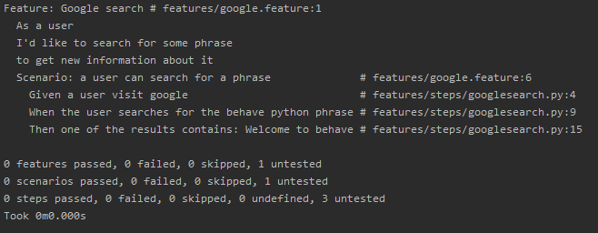

## Who am I?

Python developer  
Scrum Master  
Tech and soft skills trainer  
Creative Mom  
Visual Thinking enthusiast  

Where you can find me:  
[](https://twitter.com/Malek_Agnieszka)
[](https://www.facebook.com/agnieszka.j.malek)
[](https://github.com/Aga-Ma)
[](https://www.linkedin.com/in/agnieszka-j-malek/)

## Workshop goals

After the training:
* You will know the BDD concept and its advantages
* You will know how to work with `behave` framework  
* You will be able to create tests based on gained knowledge  

## Agenda

- [BDD - let's grab a little context](#bdd)
  - [What is behavior?](#what-is-behavior)
  - [What is BDD?](#what-is-bdd)
  - [Benefits of BDD](#benefits-of-bdd)
  - [Python BDD test frameworks](#python-bdd-test-frameworks)  
- [Installation check](#installation-check)  
- [Behave test Framework](#behave-test-framework)    
  - [Feature files](#feature-files)  
    - [Gherkin mechanics](#gherkin-mechanics)  
    - [Writing a scenario](#writing-a-scenario)  
  - [Steps](#steps)  
    - [Step file creation](#step-file-creation)  
  - [Selenium](#selenium)  
    - [Introduction to UI testing](#introduction-to-ui-testing)  
    - [POM](#pom)  
  - [Steps implementation](#steps-implementation)  
    - [Dryrun](#dryrun) 
    - [Step Parameters](#step-parameters)  
  - [Context](#context)   
  - [Hooks](#hooks)
  - [Fixtures](#fixtures)
  - [Step Data](#step-data)  
    - [Multiline text](#multiline-text)
    - [Tables](#tables)
    - [Execute step in a step](#execute-step-in-a-step)
  - [Scenario outline](#scenario-outline)  
- [Tags](#tags)  
- [Summary](#summary)
  - [The DuckDuckGo example](#the-duckduckgo-example)  
  - [Allure reports](#allure)
  - [Debug](#debug)
- [Practice](#practice)  


*** Some parts of this outline were created based on official [behave tutorial](https://behave.readthedocs.io/en/latest/tutorial.html) ***


# BDD
## What is behavior?
In software it describes how the software operates  

I had a problem. While using and teaching agile practices like test-driven development (TDD) on projects in
different environments, I kept coming across the same confusion and misunderstandings. Programmers wanted
to know where to start, what to test and what not to test, how much to test in one go, what to call their
tests, and how to understand why a test fails.  
[_Dan North_](https://dannorth.net/introducing-bdd/)

Where does TDD fall short:
* In TDD process developers want to know what to test, how much to test, and how to understand failing tests
* Whiteout clear guidelines as to what should be tested and how confusion and misunderstanding are common
* Presenting in a different light through BDD allow the development process to avoid a number of pitfails

### It answers WHAT more than HOW
Behavior are defined early in development using specification by example: plain-language descriptions (Gherkin) that tell what more than how
Behavior specs becomes requirements, ACC and acceptance tests (all in one)  

BDD emphasizes the client's perspective  

## What is BDD?
BDD is a second-generation, outside–in, pull-based, multiple-stakeholder, multiple-scale, high-automation, 
agile methodology. It describes a cycle of interactions with well-defined outputs, resulting in the delivery 
of working, tested software that matters. 

_Dan North_ 

## Benefits of BDD

The Big BDD picture: The main goals of BDD are collaboration and automation

* Allows everybody involved to write tests not just coders
* Supports collaboration - behviors testing allows you to test your application as a whole in such a way that all
stakeholders can define and understand what is being test
* Supports automation
* Behavior are identified using specification by example
* Encourage thinking about the application in a natural consistent language
* Behavior specs becomes requirements, ACC and acceptance tests (all in one)
* BDD is a refinement of Agile process, not an overhoul - formalizes ACC and test coverage

## Python BDD test frameworks

[Behave](https://behave.readthedocs.io/en/latest/)  
[pythest-bdd](https://pytest-bdd.readthedocs.io/en/latest/)  
[radish](http://radish-bdd.io/)  
[lettuce](http://lettuce.it/)  
  
[Python BDD framework comparison - Automation Panda Blog](https://automationpanda.com/2019/04/02/python-bdd-framework-comparison/)

# Installation check

Pre-training preparation - [behave_workshop/installation.md](installation.md)

# Behave Test Framework

## Feature Files

Feature files has a natural language format - describing a feature or part of a feature with representative examples of
expected outcomes

### Gherkin mechanics
Given, when, then (and, but) - forms the actual steps. Those map to python step implementation.

<span style="color: red;">**Feature**</span>: feature name  

&nbsp;&nbsp;<span style="color: blue;">**Scenario**</span>: some scenario   
&nbsp;&nbsp;&nbsp;&nbsp;<span style="color: green;">**Given**</span> some condition <span style="color: grey;">#put the system in a known state</span>   
&nbsp;&nbsp;&nbsp;&nbsp;<span style="color: green;">**When**</span> some action taken <span style="color: grey;">#we take key action the user or external system performs</span>   
&nbsp;&nbsp;&nbsp;&nbsp;<span style="color: green;">**Then**</span> some result is expected. <span style="color: grey;">#we observe outcomes</span>   


You may also include "And" or "But" as a step - those are renamed by behave to take the name of their preceding step
### Writing a scenario

Behave operates on paths
1. features - with feature files written by your business analyst / sponsor / product owner / whoever 
with your behavior scenarios
2. steps - with python step implementation for the scenarios

Steps:  
1. Create a `features` directory in your project path  
2. In `features` directory create a file `google.feature`  

3. Write your first scenario  
  
4. Run it with `behave` command
5. Go further to fix it ;)

## Steps

Steps used in the scenarios are implemented in Python files in the `steps` directory.
You call the files whatever you like as long as they use the `.py` extension. You don't need to tell behave which ones to
use - it will use all of them.

### Step file creation

Step definition - a python function decorated by a matching string in a step definition module.  
Given, When, Then steps are "glued" to a step definitions with decorators.  

Steps are identified using decorators which match the predicate from the feature file: given, when, then, step.  
The decorators accepts a string containing the rest of the phrase used in the scenario step.  

1. Create a `steps` directory in `features` path  
2. In `steps` directory create a file `googlesearch.py`  
  
3. Run it with `behave` - behave prints all missing steps as `step_impl`
The function names do not need to have a unique symbol name. The text matching selects the step function from the step 
registry before it is called as anonymous function.  
Anonymous function - function definition that is not bound to an identifier. Anonymous functions are often arguments being
passed to highest order functions.  
  

## Selenium

### Introduction to UI testing

### POM

## Context

It's variable where you and behave can store information to share around.  
It runs at three levels and is automatically managed by behave. When behave launches into a new feature or scenario it adds
a new layer to the context, allowing new activity level to add new values or overwrite ones previously defined, for 
the duration of the activity.  

It is an instance of behave.runner.Context.  

## Steps implementation

### Dryrun  

4. Correct our feature file to serach for something meaningful  
  
5. Run precheck to check if behave can find our steps definitions: `behave --dry-run`  
  

### Step Parameters  

Our feature still looks ugly.
It just not make sense to have a searched phrase and expected result hardcoded.  

You may define a single Python step for multiple cases

1. Let's modify our feature file  
   
2. And the steps file accordingly  
     
3. Check if everything looks fine `behave --dry-run`   

Step definitions can use different types of step matchers and can also take parametrized input.

## Hooks

Hooks should handle automation concerns that should not be exposed through Gherkin eg. selenium
webdriver setup and cleanup.  
Hooks are always get run despite failures.  

`environment.py` file for hooks must appear under `features` directory. It define code to run 
before and after certain event during testing.

before_* and after_* options:  
- scenario  
- feature  
- step  
- tag  

You can define values in your environmental controls file which may be set  at the feature level and then
overriden for some scenarios.
Changes made at the scenario level won't permanently affect the value at the feature level.

## Fixtures

Simplyfy the setup/cleanup tasks that are often needed during test execution.  

## Step Data  

### Multiline text

Any text block following a step wrapped im """ """ lines will be associated with the step.  
The multiline text is available to the Python step code as the `.text` attribute in the context 
variable passed into each step function.   

### Tables

You may also associate a table of data with a step by entering it, indented, following the step.  
It is useful for loading specific required data into a model.

Data tables are available to the Python step code as the `.table` attribute in the context variable.   

### Execute step in a step  

```python
    @step('some step')
    def step_impl(context):
        context.execute_steps(u''' 
            when ...
             and ... ''')
```
     
## Scenario outline

Sometimes a scenario should be run with a number of variables giving a set of known states, actions to take
and expected outcomes.  

Behave will run the scenario once for each (non-heading) line appearing in the example data tables.

# Tags

Controlling things with tags  
This allow behave to selectively check parts of your feature.

E.g.,  
```bash
--tags=tag_name
--tags="not @tag_name"
```

Tags selection may be combined  
```bash
--tags="@wip or @slow"
--tags="@wip and @slow"
```

# Summary

Put it all together  

## The DuckDuckGo example

### Demo

### Allure  

How to generate reports

## Debug

```bash
behave -D BEHAVE_DEBUG_ON_ERROR
```

# Practice

Go to: [Aga-Ma/behave_workshop](https://github.com/Aga-Ma/behave_workshop)
 
- Blog features - [blog/features](../blog/features)  
- E-learning portal features - [e-learning_portal/features](../e-learning_portal/features)  

